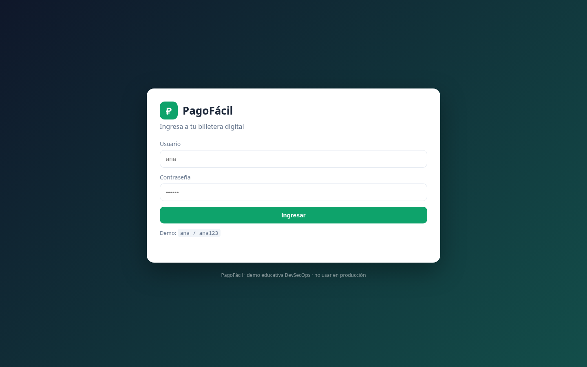
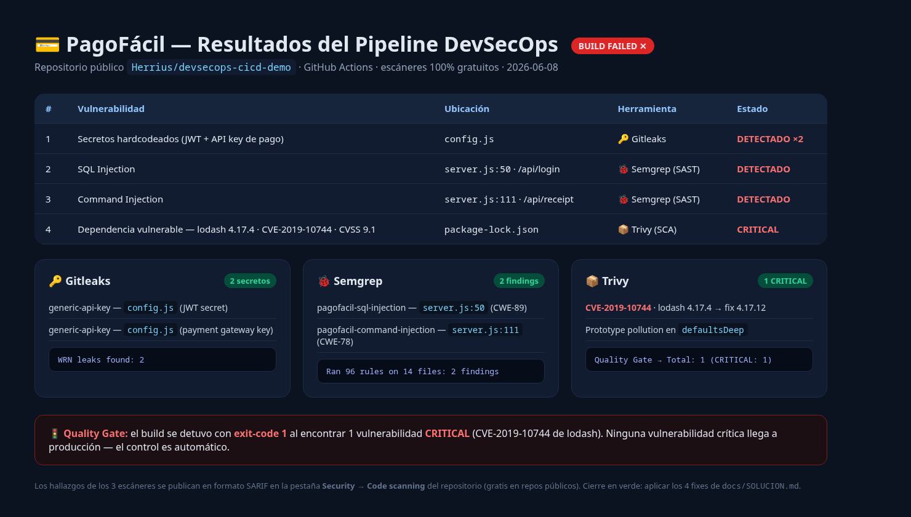
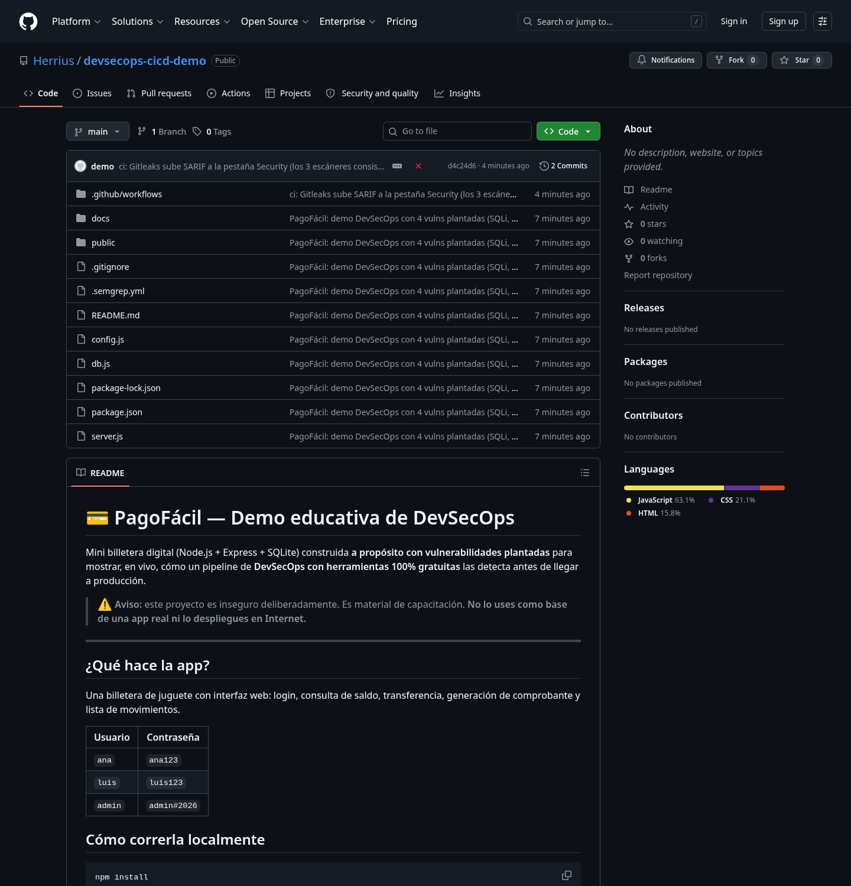
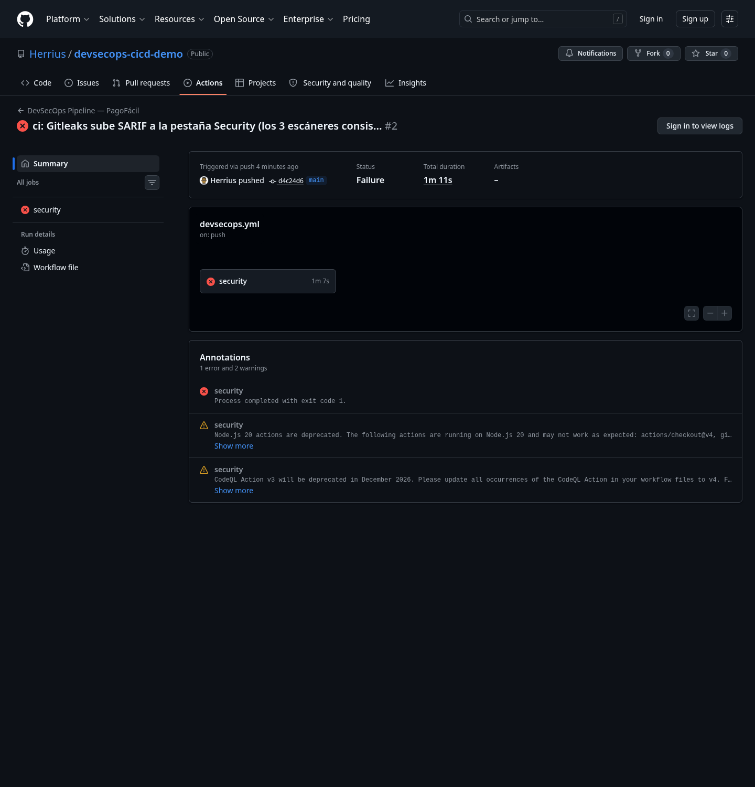

# 📋 PLAN B + DOSSIER COMPLETO — Demo DevSecOps "PagoFácil"

> Documento único de respaldo para la exposición. Si durante la demo en vivo
> falla el wifi, el proyector o el repositorio, **todo lo necesario está aquí**:
> el contexto de cómo se construyó, los resultados verificados con logs exactos,
> y capturas listas para mostrar como slides.

- **Repositorio público:** https://github.com/Herrius/devsecops-cicd-demo
- **Local (Linux):** `/home/enrique/devsecops-cicd-demo`
- **Fecha:** 2026-06-08
- **Stack de la demo (100% gratis):** Gitleaks · Semgrep · Trivy · GitHub Actions · Code Scanning (SARIF) — sin costo en repos públicos.

---

## 1. Qué es y para qué sirve

**PagoFácil** es una mini billetera digital (Node.js + Express + SQLite) construida
**a propósito con 4 vulnerabilidades plantadas**, una por cada tipo de escáner.
Sirve para demostrar, en vivo, cómo un pipeline de DevSecOps gratuito las detecta
y **rompe el build antes de que lleguen a producción**.

Cómo correrla:
```bash
npm install && npm start    # http://localhost:3000  (usuario ana / ana123)
```

---

## 2. CONTEXTO — cómo se llegó a esta demo (para entender las decisiones)

Esta sección documenta el razonamiento, no solo el resultado.

### 2.1 Por qué NO se usó OWASP Juice Shop
La primera versión de la demo se montó sobre Juice Shop, pero generaba **demasiado
ruido**: 172 leaks de Gitleaks y 22 findings de Semgrep (hallazgos didácticos del
propio proyecto vulnerable). Para una demo en vivo eso confunde. **Decisión:**
construir una mini-app propia con vulnerabilidades **curadas** — cada escáner
detecta algo limpio y predecible.

### 2.2 Por qué una app de banca/fintech
Se eligió el dominio fintech ("PagoFácil") porque **resuena con el bloque de
Veracode** de la exposición (Open Banking / SBS / PCI DSS) y eleva el impacto
narrativo: una SQLi o un secreto filtrado en una billetera digital "duele" más.
El diseño se apoyó en estándares reales (OWASP API Security Top 10 2023, controles
de AuthN/AuthZ, PCI DSS v4.0) para que sea creíble.

### 2.3 Las 4 vulnerabilidades plantadas
| # | Vuln | Dónde | La caza |
|---|---|---|---|
| 1 | Secretos hardcodeados (JWT + API key de pago) | `config.js` | 🔑 Gitleaks |
| 2 | SQL Injection | `server.js:50` (`/api/login`) | 🐞 Semgrep |
| 3 | Command Injection | `server.js:111` (`/api/receipt`) | 🐞 Semgrep |
| 4 | Dependencia vulnerable `lodash@4.17.4` (CVE-2019-10744, CVSS 9.1) | `package-lock.json` | 📦 Trivy |

### 2.4 Dos imprevistos que se resolvieron (y son anécdotas útiles para la charla)

**(a) El SAST no detectaba nada al principio.** Las primeras reglas custom de
Semgrep esperaban la concatenación *dentro* de `prepare()`/`exec()`, pero el código
arma la cadena en una variable intermedia (`query`, `cmd`). Resultado: **0 findings**.
Se reescribieron en **modo taint** (rastrea `req.body`/`req.query` hasta el sink,
aunque pase por variables). *Lección para la audiencia:* el SAST es tan bueno como
sus reglas; un patrón mal escrito da falsos negativos silenciosos.

**(b) GitHub bloqueó el primer push.** La clave original tenía formato Stripe real
(`sk_live_…`) y **GitHub Push Protection** la detectó y rechazó el push (una capa de
defensa *previa* al pipeline). Se cambió por un secreto genérico de alta entropía
que **Gitleaks sí detecta** pero que no es un patrón de proveedor real. *Beneficio
extra:* así la demo es **replicable por cualquiera** sin chocar con esa protección.

---

## 3. RESULTADOS VERIFICADOS (logs exactos)

Verificado dos veces: **localmente vía Docker** y **en la nube vía GitHub Actions**.
La corrida de referencia es la **#2** del repo.

### 🔑 Gitleaks — secretos
```
6:43PM INF 2 commits scanned.
6:43PM WRN leaks found: 2
```
Detalle: 2 × `generic-api-key` en `config.js` (el JWT secret y la API key de pago).

### 🐞 Semgrep — SAST
```
Ran 96 rules on 14 files: 2 findings.
• Findings: 2 (2 blocking)
```
Detalle:
- `pagofacil-sql-injection` → `server.js:50` (CWE-89)
- `pagofacil-command-injection` → `server.js:111` (CWE-78)
- **0 falsos positivos.**

### 📦 Trivy — SCA (paso Quality Gate, solo CRITICAL)
```
package-lock.json (npm)
Total: 1 (CRITICAL: 1)
│ lodash │ CVE-2019-10744 │ CRITICAL │ fixed │ 4.17.4 │ 4.17.12 │ prototype pollution in defaultsDeep │
```

### 🚦 Quality Gate — resultado del build
```
Quality Gate (falla en CRITICAL) → Process completed with exit code 1
```
**Build = FAILURE.** Es el comportamiento deseado: ninguna vuln CRITICAL pasa.

### Pestaña Security → Code scanning (SARIF de los 3)
- Gitleaks: 2 alertas · Semgrep OSS: 2 alertas · Trivy: 10 alertas (5 "error", todas de lodash; la CRITICAL es CVE-2019-10744).

### PoC manual en vivo (sin herramientas)
- **SQLi / bypass de login:** usuario `admin'--`, contraseña cualquiera → entra como Administrador (S/ 99999.99) sin saber la clave.

---

## 4. CAPTURAS (mostrar como slides si algo falla)

Carpeta: `docs/plan-b/capturas/`. El panel `02` es el respaldo más confiable:
no depende de que GitHub cargue ni de estar logueado; contiene todos los datos
reales del run.

### 01 — La app PagoFácil corriendo (UI de login)
*Cuándo usarla: si no levanta el server en vivo.*



### 02 — Panel-resumen de resultados  ⭐ slide principal
*Todos los hallazgos + logs exactos en una sola imagen.*



### 03 — Home del repositorio en GitHub
*Para mostrar el código y la estructura del proyecto.*



### 04 — Corrida de Actions en rojo (Failure, exit code 1)  ⭐
*La prueba de que el Quality Gate rompe el build.*



---

## 5. Guion express de la demo (8–10 min)
Guion detallado minuto a minuto en [`docs/guion-demo.md`](guion-demo.md). Resumen:
1. App funciona → PoC de SQLi en vivo (`admin'--`).
2. Mostrar `server.js` + `config.js` + el workflow `devsecops.yml`.
3. Security tab: Gitleaks (secretos) → Semgrep (SQLi + cmd injection) → Trivy (CVE crítica).
4. Actions en rojo: el Quality Gate detuvo el build.
5. Cierre en verde con los fixes (`docs/SOLUCION.md`).

## 6. Cierre en verde
Los 4 fixes están en [`docs/SOLUCION.md`](SOLUCION.md): env vars (Gitleaks),
consulta parametrizada (SQLi), `execFile` con args (cmd injection), bump de
lodash a 4.17.21 (Trivy). Aplicarlos → pipeline en verde.

## 7. Notas / troubleshooting
- Las 2 *warnings* de deprecación en Actions (Node.js 20 / CodeQL Action v3) son
  de GitHub, **inofensivas**: el pipeline corre igual. No afectan la demo.
- La 1ª indexación de SARIF en la pestaña Security tarda 1–2 min tras el push.
- Si `npm ci` falla por versión de Node, usar `npm install`.
